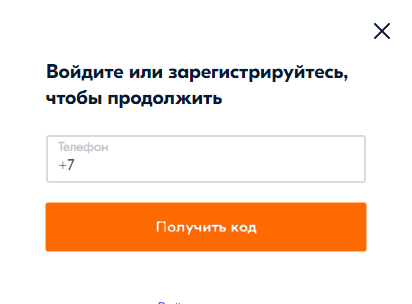
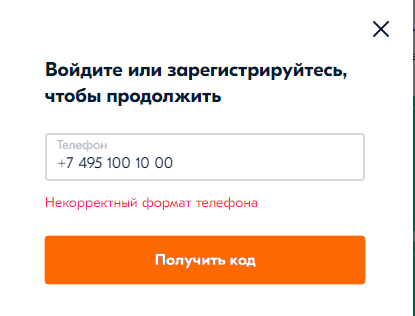
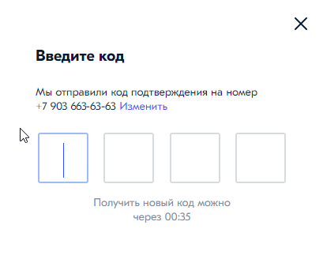
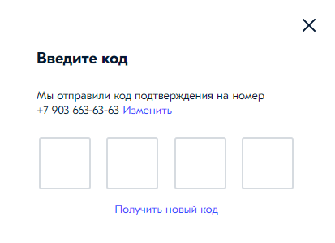
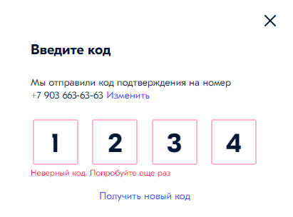
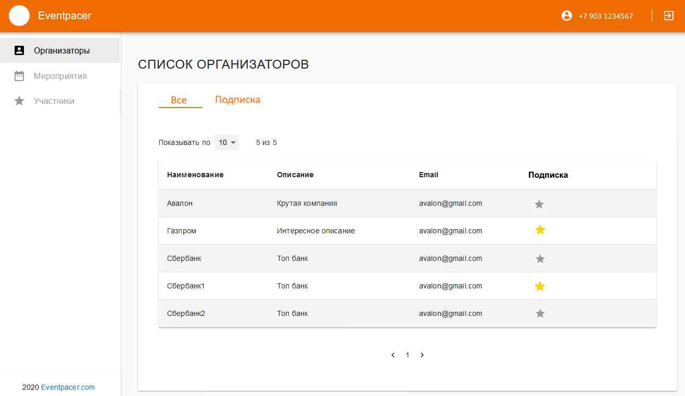

# Тестовое задание

Для реализации использовать react + typescript.

## 1. Вход по СМС

Необходимо сделать формы для входа по коду из СМС.
Форма отображается при нажатии на кнопку "войти" в виде popup c крестиком.

При нажатии на "Получить код" вызвать /api/auth/requestCode

После этого отобразить форму ввода кода подтверждения:

После превышения количества попыток ввода кода, необходимо вернуть пользователя на диалог ввода номера телефона.
Для проверки правильности кода вызвать /api/auth/login

Если аккаунт с указанным номером не существует, то он создается при вводе правильного кода.
Таким образом сценарий входа одновременно является сценарием регистрации.

Для тестов использовать номера с кодом +0, код подтверждения 1101

Описание API: https://eventpacerstage.azurewebsites.net/swagger/index.html

## 2. Список организаторов

После успешного входа отобразить список организаторов, полученный с помощью /api/user/orgs

## 3. Подписка

Реализовать возможность подписаться по клику на звёздочку в списке организаторов, вызывая ​/api​/user​/orgs​/{orgId}​/subscription
